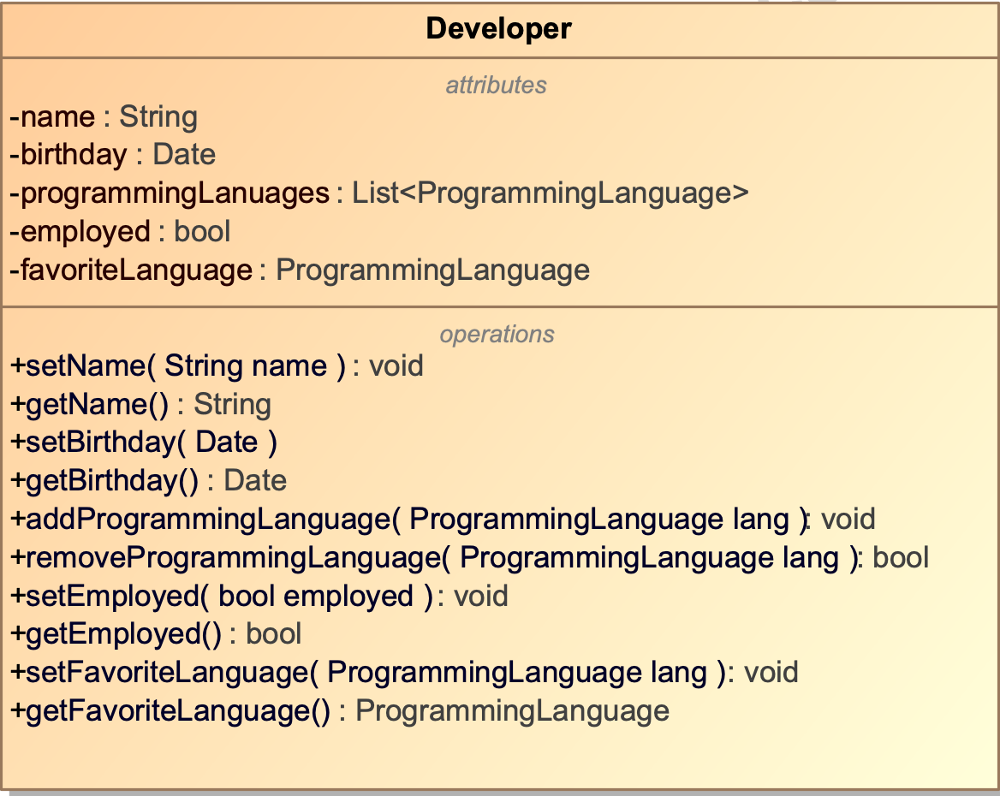

# Exercise 1

## 10 advantages of an IDE

1. Code Editing
2. Integrated Debugger
3. Version Control Integration
4. Project Management
5. Auto-Build and Deployment
6. Code Templates and Snippets
7. Plugin Ecosystem
8. Code Analysis Tools
9. Integrated Documentation
10. Language Support

## Prove that the ULAM function terminates for n<1M
```java
public class Ulam {
    public static void main(String[] args) {
        for (int i = 1; i <= 1_000_000; i++) {
            calculateUlam(i);
            System.out.printf("Terminated for %s%n", i);
        }
    }

    public static int calculateUlam(int n) {
        if (n == 1) {
            return 1;
        }
        if (n % 2 == 0) {
            return calculateUlam(n / 2);
        } else {
            return calculateUlam(3 * n + 1);
        }
    }
}
```

## Create a github account and commit your code

See it [here](https://github.com/c0lider/software-engineering-design).

## UML class diagram


## implementation of the programmer class
```java
import java.util.ArrayList;
import java.util.Date;
import java.util.List;

public class Developer {
    private String name;
    private Date birthDate;
    private List<ProgrammingLanguage> programmingLanguages = new ArrayList<>();
    private boolean isEmployed;
    private ProgrammingLanguage favoriteProgrammingLanguage;

    public Developer(String name) {
        this.setName(name);
    }

    // Getters and Setters
    public String getName() {
        return name;
    }

    public void setName(String name) {
        if (name != null || !name.isEmpty()) {
            this.name = name;
        } else {
            throw new IllegalArgumentException("Name cannot be null or empty");
        }
    }

    public Date getBirthDate() {
        return birthDate;
    }

    public void setBirthDate(Date birthDate) {
        if (birthDate != null) {
            this.birthDate = birthDate;
        } else {
            throw new IllegalArgumentException("Birth date cannot be null");
        }
    }

    public List<ProgrammingLanguage> getProgrammingLanguages() {
        return programmingLanguages;
    }

    public void addProgrammingLanguage(ProgrammingLanguage lang) {
        if (!this.programmingLanguages.contains(lang)) {
            this.programmingLanguages.add(programmingLanguages);
        }
    }

    public boolean isEmployed() {
        return isEmployed;
    }

    public void setEmployed(boolean employed) {
        isEmployed = employed;
    }

    public ProgrammingLanguage getFavoriteProgrammingLanguage() {
        return favoriteProgrammingLanguage;
    }

    public void setFavoriteProgrammingLanguage(ProgrammingLanguage favoriteProgrammingLanguage) {
        this.favoriteProgrammingLanguage = favoriteProgrammingLanguage;
    }
}
```


## Software engineering - design definition
In contrast to software engineering - analysis, which deals with the question WHAT needs to be implemented, the software engineering - design deals with the question HOW to implement the given task.

## Why is SWE-D necessary?
Software engineering design is necessary to ensure that the resulting software system meets the specified requirements efficiently, is maintainable, scalable, and extensible, while also being robust and reliable.

## Are the design activities of architectural design, database design, user interface design and component design independent or interdependent? Using an example, explain why
They are interdependant, because all these components need to adapt to eachother. If the developer wants to add a new property to one of their classes, the database or UI might also need to adapt.